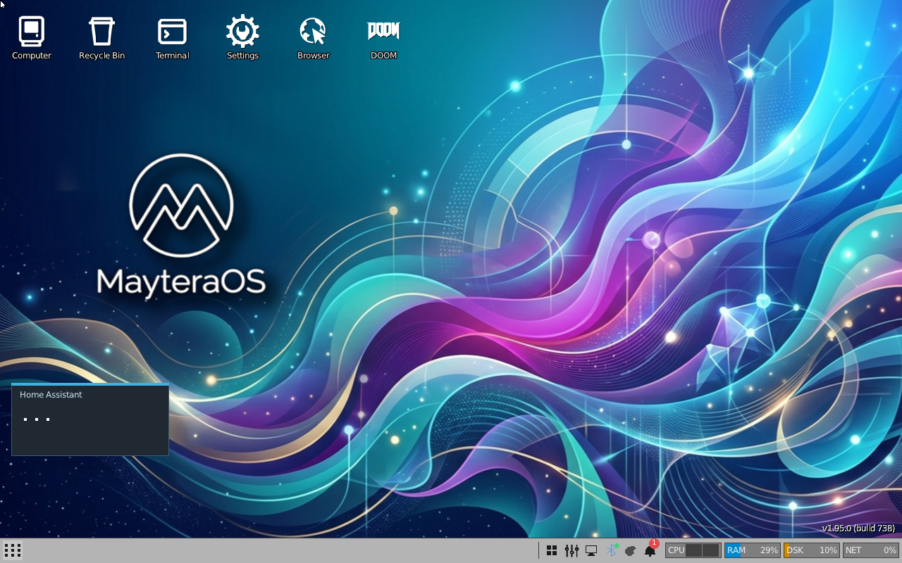
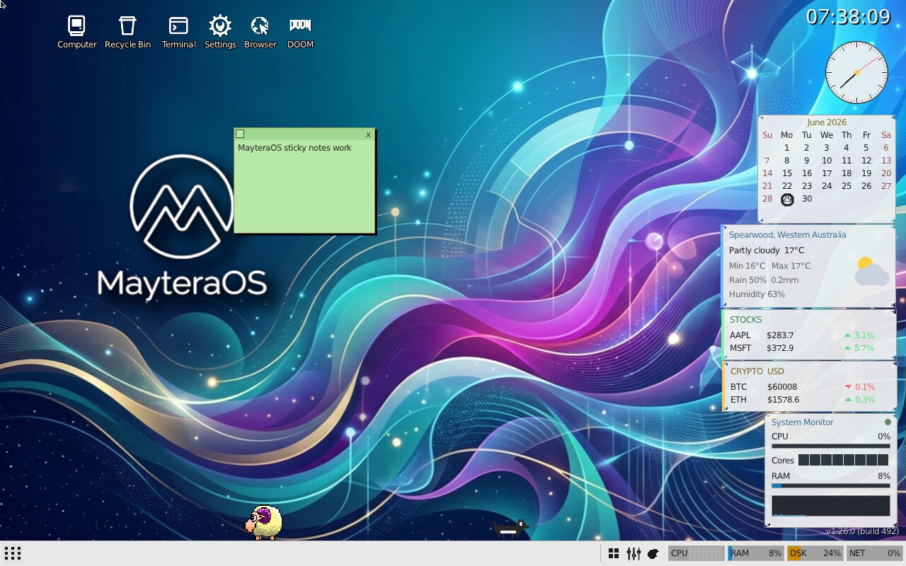
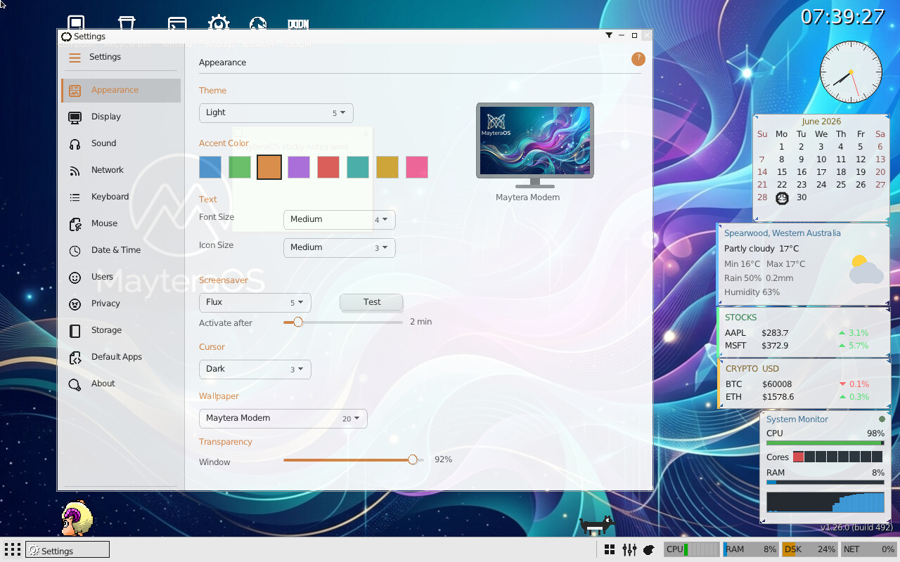
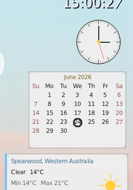
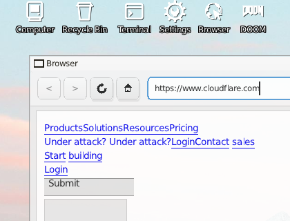
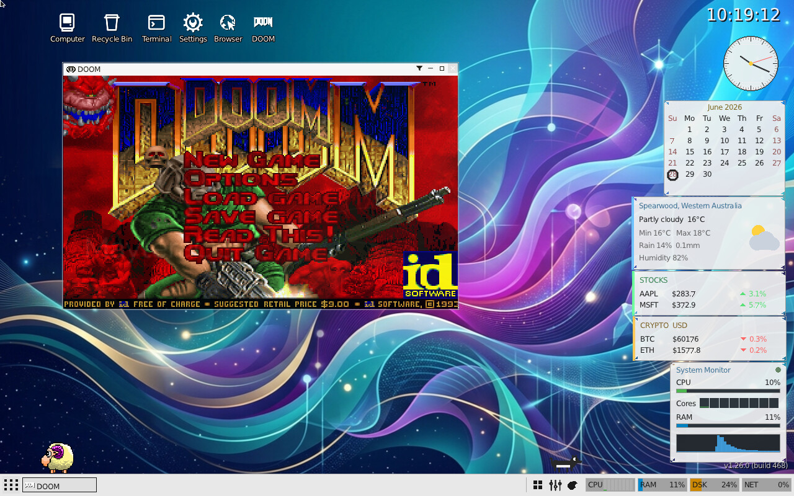
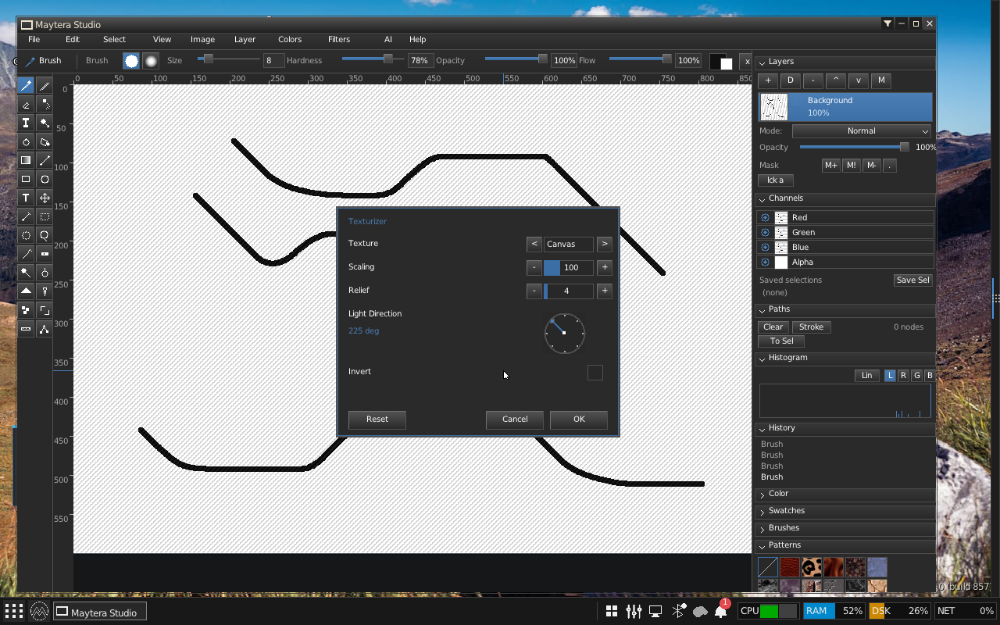

# MayteraOS

**MayteraOS is an LLM-first operating system, built entirely from scratch.**

The AI layer is not an app bolted on top - it is a first-class part of the
system. Every application publishes a machine-readable **tool contract**, and a
built-in LLM reads those contracts to operate the desktop and, with your
explicit consent, to **write, compile and run new applications, widgets and
drivers on the running machine** - every action scoped by a capability token,
gated on consent, and written to an audit trail. The operating system is
designed to be extended and reprogrammed by natural language.

Underneath that sits a complete, hand-built OS: its own UEFI bootloader, a
freestanding C kernel (SMP, demand paging, COW), a compositor desktop, an
in-house TCP/IP + TLS 1.3 stack, ext2/FAT filesystems, and a suite of native
applications. It boots on real x86-64 hardware and in virtual machines.

> Status: an ambitious, experimental research OS under active development. It
> boots to a usable desktop, but it is experimental software - don't run it on
> production hardware or a network you care about.



## Screenshots

| | |
|---|---|
|  |  |
| The desktop: wallpaper, icons, taskbar gauges, widgets | The Settings app (style engine + TTF) |
|  |  |
| Desktop widgets (clock, calendar, weather, monitors) | The web browser with a TLS 1.3 client |
|  |  |
| DOOM, running on the MayteraOS platform layer | Maytera Studio: the Texturizer filter dialog, with the angle dial, over the layers, channels, paths and histogram docks |

## Highlights

- **LLM-first architecture** - every app publishes a YAML **tool contract**; a
  built-in LLM reads them to drive the desktop and, on your consent, generate,
  compile and run new apps/widgets/drivers on the live system. Every action is
  scoped by a **capability token**, gated on consent, and written to an audit
  trail. Prompt-injection protection ships in the kernel (the Nova ruleset).
- **Kernel** - long-mode paging with demand paging and copy-on-write, a
  preemptive scheduler with SMP (schedules on a second core), ELF and PE
  loaders, signals, futexes, and a wait-queue-based blocking layer.
- **Graphics + desktop** - a framebuffer compositor with damage-tracked
  redraw, drop shadows, TTF text, a themeable style engine, taskbar, start
  menu, and desktop widgets.
- **Applications** - Files, Terminal, Settings, a text editor, calculator,
  image viewer, an IRC client, a web browser, a music player, Task Manager, and
  **Maytera Studio**, a GIMP-class image editor (90+ filters and adjustments,
  layers with masks and 28 blend modes, channels, paths, transforms, and a
  zoomable loupe preview in the filter dialogs).
- **OS-wide editing** - one shared clipboard and one set of standard editing
  shortcuts across the system, rather than each app implementing its own.
- **Rust in the kernel** - an incremental port. Live today: the IP, TCP and UDP
  checksums, the ext2 directory parser, the ICMP/ARP/DNS/DHCP/URL parsers, the
  ELF and PE loaders, several hashes and ciphers, the syscall argument table,
  and the clipboard. Each ported piece keeps its C original for rollback and is
  checked against it with a differential test. See `kernel/RUST_PORT_LEDGER.md`,
  which records the honest per-component status including where a result was
  weaker than it first looked.
- **Networking + filesystems** - an in-house TCP/IP stack (ARP, IP, UDP, TCP,
  DHCP, DNS), TLS 1.3 with certificate validation, SSH client/server; ext2 and
  FAT32 (VFAT long names) behind a VFS. A failing interface is marked FAULTY
  and stops being polled rather than busy-spinning.
- **Graphics + games** - TinyGL software OpenGL, used by the 3D apps and games.
- **Compatibility layers** - a Win16 (Windows 3.x NE) interpreter and a DOS
  layer. These are *runtimes*, not bundled software: they run applications you
  supply yourself. No third-party application ships with this repository.
- **Languages** - a Python interpreter runs on the OS, with a growing slice of
  the standard library.

Where things are partial, they are marked partial rather than dressed up. The
browser's JavaScript is a ported Duktape, so it is ES5.1-era with no event loop:
it evaluates scripts but does not drive an interactive, event-driven page.

## Repository layout

```
kernel/      Freestanding kernel: mm/ cpu/ proc/ exec/ fs/ net/ crypto/
             video/ drivers/ gui/ (windowing + built-in apps) games/ ...
userland/    libc/ (freestanding C library + crt0), user.ld linker script,
             and apps/ (each builds a Ring 3 ELF)
tools/       Build-time helpers (e.g. the concurrency lint)
boot/        UEFI bootloader source (BOOTX64.EFI)
disk/        Disk template: CONFIG, THEMES
screenshots/ Images used by this README
```

## Building

MayteraOS builds with a GCC cross toolchain targeting freestanding x86-64.

Prerequisites (Debian/Ubuntu package names):

```sh
sudo apt install build-essential nasm gnu-efi mtools dosfstools gdisk
```

`gnu-efi` provides the `efi.h` headers the UEFI bootloader needs; without it
`boot/uefi` fails to compile. A few userland apps are written in Rust and need
a pinned `rustc` (see their `rust-toolchain.toml`); `build.sh --all-apps`
reports those as failures at the end and carries on without them, so the rest
of the system still builds if you do not have a Rust toolchain installed.

### The build that was actually run

These are the exact steps used to produce the published release, on Debian 12
with gcc 12, not an idealised version of them:

```sh
git clone https://github.com/referefref/maytera-os.git
cd maytera-os
./build.sh --all-apps          # libc, then libgl, then kernel, bootloader, apps
sudo SIZE_MB=512 IMG=/tmp/maytera.img ./stage-disk.sh
```

`build.sh` builds `userland/libgl` (TinyGL) before the app loop on purpose: the
3D apps link `../../libgl/libgl.a`, and building them first fails at Arena with
`No rule to make target '../../libgl/libgl.a'`.

**Not everything builds from a clean clone, and the script tells you so.** In
the release build, 7 of the optional apps failed and `build.sh` listed them at
the end rather than failing the whole build or hiding it:

| App | Why |
|---|---|
| `browser` | Needs two trees that are not in this repository: a NetSurf port and a Duktape build. Its Makefile points at absolute paths outside the repo, so it cannot build from a clean clone. This is a known gap. |
| `python`, `curaslice`, `rogue`, `rctrl` | Need toolchains or vendored sources not present in a minimal environment. |
| `filebrowser` | Fails on a `conflicting types for 'dirent_t'`. A real bug, not a missing prerequisite. |
| `ipc_test` | Its Makefile is missing an `-isystem` flag and fails on `stddef.h`. |

The kernel, the bootloader, the compositor and the other 119 applications do
build, and the resulting image boots to a desktop. `stage-disk.sh` installs
whatever ELF executables it finds, so an app that failed to build is simply
absent from the image rather than being silently replaced by a stale copy.

### Assets

Wallpapers, the full font set and boot art are large binary assets and are not
committed to git. The build does not fetch them, and the OS does not need them:
with no wallpaper present the desktop falls back to a gradient, which is exactly
what the published release image looks like. Point `stage-disk.sh` at your own
with `WALLPAPERS_DIR=/path/to/bmps`. The fonts and project artwork are
redistributable (OFL, Bitstream, or public domain) and are hosted separately on
the Maytera update server rather than in this repository.

The kernel is built with, roughly:

```
-ffreestanding -nostdlib -nostdinc -fno-builtin -mno-red-zone \
-mcmodel=kernel -msse -msse2 -Wall -Wextra -Werror
```

```sh
cd kernel
make clean && make -j4        # produces kernel.elf
```

User applications link against the in-tree `userland/libc` and the
`userland/user.ld` script (Ring 3 load base). Each app under `userland/apps/`
has its own `Makefile`.

The result is a UEFI-bootable OS: the `BOOTX64.EFI` loader reads
`kernel.elf` from a FAT32 EFI System Partition. See the design docs for the
boot flow and memory model (UEFI identity mapping, so physical == virtual in
the kernel).

### Assembling a bootable image

`stage-disk.sh` lays the build outputs onto a GPT/FAT32 disk image:

```sh
sudo ./stage-disk.sh                 # writes ./boot_disk.img
```

Two categories of content are deliberately **not** in this repository, and the
image is usable without either:

- **Large binary assets** (wallpapers, the full font set, boot art). Point the
  script at your own with `WALLPAPERS_DIR=/path/to/bmps`. The kernel falls back
  to a gradient desktop when a wallpaper is absent.
- **Third-party software and game data** (DOOM's `DOOM1.WAD`, any Windows or
  DOS application, media player skins). These are other people's copyrighted
  work and are not ours to redistribute. Supply your own, for example
  `DOOM_WAD=/path/to/DOOM1.WAD ./stage-disk.sh`.

## Releases

Bootable images are published under this repository's
[Releases](https://github.com/referefref/maytera-os/releases).

### Verify what you downloaded

```sh
sha256sum maytera-os.iso
```

The expected checksum is published in the release notes. Check it before you
write the image to anything.

### Boot it

The `.iso` is a **hybrid image**: it carries a GPT whose EFI System Partition
holds the whole system. Write it to a USB stick, or attach it to a VM as a
**disk**.

```sh
# USB stick (DESTROYS the target disk - check the device name twice)
sudo dd if=maytera-os.iso of=/dev/sdX bs=4M conv=fsync status=progress

# QEMU, UEFI firmware required. Attach as a DISK, not as a CD.
qemu-system-x86_64 -machine pc -cpu kvm64 -m 2048 \
  -bios /usr/share/OVMF/OVMF_CODE.fd \
  -drive file=maytera-os.iso,format=raw,if=ide \
  -serial stdio
```

**It will not boot as a virtual CD-ROM**, and this is a real limitation rather
than an oversight. The firmware would load the bootloader, but the kernel's ATA
driver implements only the ATA read commands and no ATAPI packet interface, so
it cannot read an optical device and would find no root filesystem. Attach the
image as a disk or write it to a USB stick.

Use machine type `pc` (i440fx). The ATA driver expects a legacy IDE controller
at the traditional port addresses, which `q35`'s AHCI does not provide. Use
`kvm64` rather than host CPU passthrough.

The image signs in automatically as `root` (see `disk/CONFIG/LOGIN.CFG`) and
goes straight to the desktop. Remove that file if you want the login prompt;
the default accounts are `root`/`root` and `admin`/`admin`.

### What is in the image, and what is deliberately not

The image contains the kernel, the UEFI bootloader, the compositor desktop and
the native applications, built from this repository. It is built on a **fresh
filesystem** by `stage-disk.sh` and contains **no credentials**.

Deliberately absent, because it is other people's copyrighted work and not ours
to redistribute:

Microsoft Word 6, the Microsoft Entertainment Pack titles (Tetris, JezzBall,
Chips Challenge, Golf, TetraVex, Rodent's Revenge, Tut's Tomb, FreeCell),
SkiFree, Corel, Photoshop, the Visual Basic runtime, `DOOM.WAD` and any other
game data, WinAmp skins, and every DOS and Windows application.

MayteraOS builds and boots without any of them. The Win16 and DOS layers are
compatibility *runtimes*: they exist to run software you already own and supply
yourself. Because those titles are absent, some Start menu entries for them
point at files that are not on the image and will do nothing when clicked.
Applications that use optional assets degrade rather than fail; Maytera HiFi,
for example, falls back to its built-in palette skins when no skin files are
present.

## Licensing

MayteraOS's own code is released under the **GNU General Public License,
version 2 or later** (see [LICENSE](LICENSE)); GPLv2 is required because the
kernel statically links GPL codec libraries (libmad, faad2). Vendored
open-source libraries retain their own license files in their subdirectories,
and third-party assets are credited in [ATTRIBUTION.md](ATTRIBUTION.md). The
bundled **DOOM** engine source is under id Software's separate *DOOM Source
Code License* (see `kernel/games/doom/DOOMLICENSE.md`), not the GPL.

## Acknowledgements

The LLM prompt-injection protection in MayteraOS's AI layer is built on the
**Nova** open ruleset by **Thomas Roccia** ([@fr0gger_](https://github.com/fr0gger/nova-framework)),
(c) 2025, MIT License. See `kernel/security/nova.c`.

Third-party libraries and assets and their licenses are listed in
[ATTRIBUTION.md](ATTRIBUTION.md).
