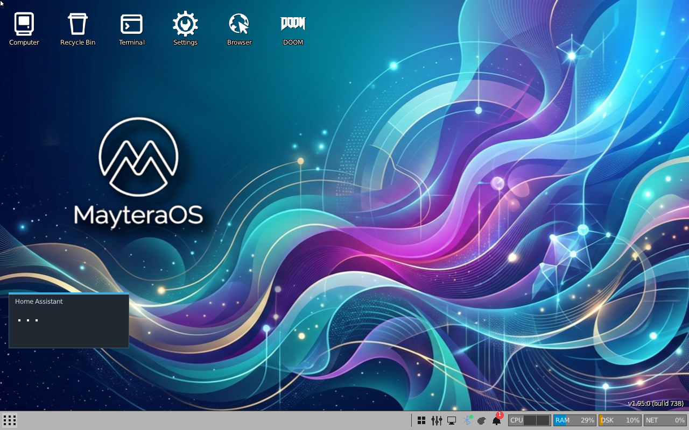
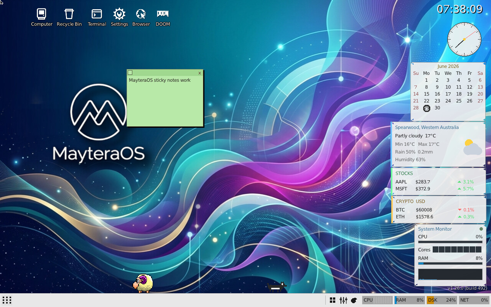
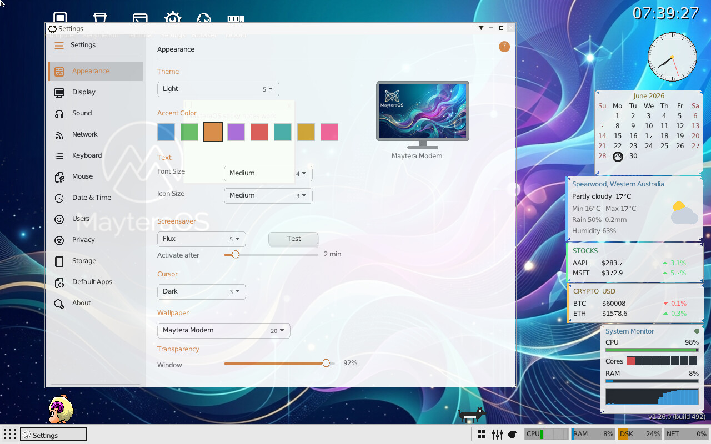
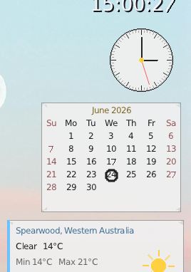
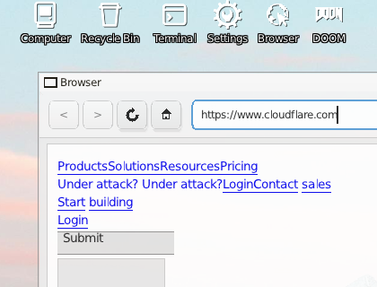
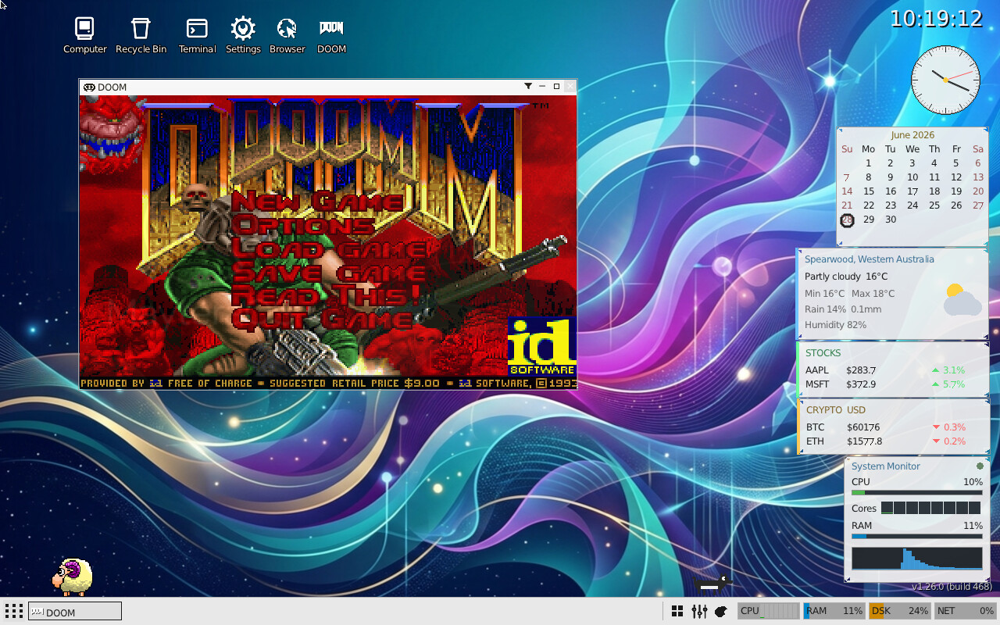
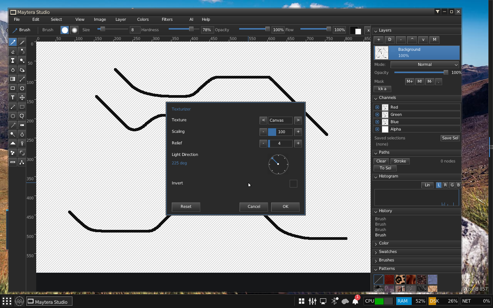

# MayteraOS

**MayteraOS is an LLM-first operating system, built entirely from scratch.**

The AI layer is not an app bolted on top, it is a first-class part of the
system. Every application publishes a machine-readable **tool contract**, and a
built-in LLM reads those contracts to operate the desktop and, with your
explicit consent, to **write, compile and run new applications, widgets and
drivers on the running machine**, every action scoped by a capability token,
gated on consent, and written to an audit trail.

Underneath that sits a complete, hand-built OS: its own UEFI bootloader, a
freestanding C and Rust kernel (demand paging, copy-on-write, a preemptive
scheduler), a compositor desktop, an in-house TCP/IP + TLS 1.3 stack, ext2/FAT
filesystems, and a suite of native applications. It boots on real x86-64
hardware and in virtual machines.

> Status: an ambitious, experimental research OS under active development. It
> boots to a usable desktop, but it is experimental software. Do not run it on
> production hardware or a network you care about.



**This repository: version 2.0.2, kernel build 2246.** The build number is
stamped by the build system rather than stored in the source, so
`kernel/version.h` in this tree reads `2213`. Treat that as a floor, not as a
contradiction: the image built from this exact source is stamped 2246, and the
build system takes `max(build-state, version.h) + 1`. Where this README says
"fixed in build 2246", the checkable form is the source files named beside each
fix. The most recent published binary release is `v1.95.0-b851`, which is much
older than the source here. See Releases below.

## Screenshots

| | |
|---|---|
|  |  |
| The desktop: wallpaper, icons, taskbar gauges, widgets | The Settings app (style engine + TTF) |
|  |  |
| Desktop widgets (clock, calendar, weather, monitors) | The web browser with a TLS 1.3 client |
|  |  |
| DOOM, available from the App Store. Bring your own WAD | Maytera Studio: the Texturizer filter dialog |

## Highlights

- **LLM-first architecture** - every app publishes a YAML **tool contract**; a
  built-in LLM reads them to drive the desktop and, on your consent, generate,
  compile and run new apps/widgets/drivers on the live system. Every action is
  scoped by a **capability token**, gated on consent, and written to an audit
  trail. A prompt-injection keyword guard (the Nova ruleset) ships in the
  kernel. See the honest description of its limits under Security below.
- **Kernel** - long-mode paging with demand paging and copy-on-write, a
  preemptive scheduler, ELF and PE loaders, signals, futexes, and a
  wait-queue-based blocking layer.
- **SMP is implemented but off by default in this release.** `smp_init()` runs
  and the LAPIC is brought up, and per-cpu run queues plus a safe
  context-switch handoff are in the tree, but `kernel/cpu/smp.c` ships
  `g_smp_user_sched = 0` and `kernel/main.c` starts application processors only
  when that flag is set. So on a stock build **no application processor is
  started and the whole system, kernel work included, runs on the bootstrap
  processor**. Drop an empty `/SMPSCHED.TXT` at the root of the ESP to enable
  it for one boot with no rebuild. The default is 0 because the failure it
  guards is a silent scheduler wedge rather than a crash; the comment block at
  the top of `kernel/cpu/smp.c` records what went wrong and what the bar for
  changing the default is.
- **Graphics + desktop** - a framebuffer compositor with damage-tracked
  redraw, drop shadows, TTF text, a themeable style engine, desktop widgets,
  and five selectable panel layouts (classic taskbar, Lumina, a CDE/Motif-style
  UNIX front panel, a retro top bar, and an XFCE-style glass dock).
- **Applications** - Files, Terminal, Settings, a text editor, calculator,
  image viewer, an IRC client, a web browser, a music player, Task Manager, an
  App Store client, a first-boot setup wizard, and **Maytera Studio**, an image
  editor with layers, masks, blend modes, channels, paths and a large filter
  set.
- **Rust in the kernel** - an incremental port. The kernel build currently
  enables 49 `RUST_*` switches (see `kernel/Makefile`), covering the IP, TCP
  and UDP checksums, the ext2 directory parser, the ICMP/ARP/DNS/DHCP/URL
  parsers, the ELF and PE loaders, the FAT/exFAT/ISO9660 readers, the
  BMP/PNG/JPEG/inflate decoders, several hashes and ciphers, TLS record
  parsing, the syscall argument table, and the clipboard. Each ported piece
  keeps its C original for rollback and is checked against it with a
  differential test. See `kernel/RUST_PORT_LEDGER.md`, which records the honest
  per-component status including where a result was weaker than it first
  looked.
- **Networking + filesystems** - an in-house TCP/IP stack (ARP, IP, UDP, TCP,
  DHCP, DNS), TLS 1.3 with certificate and signature validation, SSH
  client/server; ext2 and FAT32 (VFAT long names) behind a VFS.
- **Compatibility layers** - a Win16 (Windows 3.x NE) interpreter and a DOS
  layer. These are *runtimes*, not bundled software: they run applications you
  supply yourself. **No third-party application ships with this repository.**

Where things are partial, they are marked partial rather than dressed up. The
browser's JavaScript is a ported Duktape, so it is ES5.1-era with no event
loop: it evaluates scripts but does not drive an interactive, event-driven page.
The command-line utilities under `userland/apps` are minimal reimplementations
rather than POSIX-complete ones: `sed` does a literal `s/find/replace/[g]` with
no regular expressions, `tr` maps single characters with no ranges or classes,
and there is no `grep` in this release at all.

## Security

This section states what is actually implemented, and what is not. Several
neighbouring features are easy to confuse with each other, so they are listed
separately rather than summarised as "hardened".

**Implemented and live:**

- **Userland PIE with load-base randomisation.** `kernel/exec/elf.c`
  randomises the load base of every PIE user image, drawing from the kernel
  HMAC-DRBG.
- **Stack canaries.** The kernel builds with `-fstack-protector-strong
  -mstack-protector-guard=global`, and `__stack_chk_guard` is seeded with a
  real random value at boot rather than left at a constant.
- **An image-wide W^X / ELF-shape gate.** Every launched binary is checked
  against exactly the rule the kernel's own loader enforces, encoded once in
  `tools/elf-shape-check.sh` so the gate and the loader cannot drift apart. It
  has a self-test that proves it goes red on a bad shape.
- **TLS 1.3 with certificate *and* signature validation.** Skipping either was
  a real gap once; it is closed.
- **Capability tokens, consent gating and an append-only audit trail** for
  AI-initiated actions.
- **No shipped default credentials.** `create_defaults()` in
  `kernel/proc/users.c`, the function that used to mint `root`/`root` and
  `admin`/`admin`, sits behind `MAYTERA_SHIP_DEFAULT_ACCOUNTS`, and no public
  or release build defines it. A fresh install therefore has an empty user
  database, and the login gate goes to first-boot account creation
  (`LOGIN_STATE_CREATE_ACCOUNT` in `kernel/gui/login.c`), which mints the
  administrator account from a username and password you choose. The
  compositor also spawns the setup wizard, `/APPS/SETUP`, when
  `/CONFIG/SETUPDONE` is absent.
  `disk/CONFIG/LOGIN.CFG`, which `stage-disk.sh` copies onto the image, used to
  contradict this by setting `autologin=root` and describing `root`/`root` and
  `admin`/`admin` as the defaults. It no longer does: autologin ships disabled,
  and the file documents the real first-boot flow. An image staged from this
  tree stops and asks you to create an account.

**Fixed in kernel build 2246: three Ring-3 privilege-boundary holes.** Each one
let a user process reach state it did not own, each was demonstrated with a
working proof before it was fixed, and each fix is the Rust module named beside
it. If you are running anything older than build 2246, these are live:

- **Cross-process legacy file descriptors** (`kernel/rustkern/fdown.rs`,
  `kernel/proc/fdlayer.c`). The legacy descriptor table was reachable across
  process boundaries, so one process could read a file another process had
  open. Proven at descriptor 259. Descriptors now carry an owner and ownership
  is checked on every access.
- **`/dev/pts/N` attach by a non-owner** (`kernel/rustkern/ptsown.rs`,
  `kernel/drivers/pty.c`). Any process could attach to a pseudo terminal
  belonging to another user and read its input and output. Attach now requires
  ownership.
- **`sys_win_blit()` gave Ring 3 an arbitrary kernel read**
  (`kernel/rustkern/winblit.rs`, `kernel/proc/syscall.c`). The blit source
  pointer was taken from userland and used unvalidated, so a Ring-3 process
  could name a kernel address and have its contents painted into a window it
  could then read back. Proven by painting kernel text into a visible window
  with the pixel colour predicted in advance. Every row is now copied through
  `copy_from_user()`.

**Known regression in this snapshot, stated rather than left to be found.** The
`sys_win_blit()` fix above introduced a scaling fault: full-screen and maximised
windows scale incorrectly. It is a rendering defect with no security
consequence, and a fix is in progress and will land as a follow-up commit. The
security fix is worth shipping ahead of it; the cosmetic cost is not worth
hiding.

**Explicitly NOT implemented. Do not assume otherwise:**

- **KASLR. The kernel base is fixed.** `linker.ld` pins `KERNEL_PHYS_BASE` and
  nothing relocates it. `kernel/security/aslr.c` reports this honestly at boot
  ("Kernel (KASLR): not implemented").
- **Stack, heap and mmap randomisation.** Only the PIE image base is
  randomised. The per-process randomisation API that used to imply otherwise
  had zero callers and has been deleted rather than left standing as an implied
  feature.
- **A non-root desktop.** Work is in progress; this release still runs the
  desktop as the administrator account, which is uid 0.

**About the Nova prompt-injection guard:** it is a **keyword and pattern
ruleset**, not a semantic model. It raises the cost of the obvious injection
strings. It does not understand intent and must not be treated as a boundary
you can rely on. The capability token, the consent prompt and the audit trail
are the real controls.

Please report security issues as described in `SECURITY.md`.

## Repository layout

```
kernel/      Freestanding kernel: mm/ cpu/ proc/ exec/ fs/ net/ crypto/
             video/ drivers/ gui/ media/ security/ rustkern/ and kernel/tools/
             (the build-time link gates)
userland/    libc/ (freestanding C library + crt0), libgl/ (TinyGL),
             libarchive/ libcompat/ libhelp/, ports/ (zlib, pcre2),
             python/ (MicroPython port), the user.ld and user-pie.ld linker
             scripts, and apps/ (each builds a Ring 3 ELF)
boot/uefi/   UEFI bootloader source (BOOTX64.EFI)
disk/        Disk template: CONFIG (incl. start-menu drop-ins, THEME.CFG and
             LOGIN.CFG), THEMES, FONT-LICENSES
assets/      Source SVGs for the app/dock/tray icon set
docs/        Design documents and the generated Win16 API reference
tools/       Build-time helpers (ELF shape gate, theme lint)
tests/       Serial-driven integration test framework
screenshots/ Images used by this README
```

## Building

MayteraOS builds with a GCC cross toolchain targeting freestanding x86-64.

```sh
sudo apt install build-essential nasm gnu-efi mtools dosfstools gdisk
```

`gnu-efi` provides the `efi.h` headers the UEFI bootloader needs. A few
userland apps are written in Rust and need a pinned `rustc` (see their
`rust-toolchain.toml`); `build.sh --all-apps` reports those as failures at the
end and carries on, so the rest of the system still builds without a Rust
toolchain.

```sh
git clone https://github.com/referefref/maytera-os.git
cd maytera-os
./build.sh --all-apps          # libc, then libgl, then kernel, bootloader, apps
sudo SIZE_MB=512 IMG=/tmp/maytera.img ./stage-disk.sh
```

`build.sh` builds `userland/libgl` (TinyGL) before the app loop on purpose: the
3D apps link `../../libgl/libgl.a`.

Every step of `build.sh` that builds an optional port is guarded, so a port that
is absent from your tree is reported as skipped and the build carries on. An
earlier revision ran step 4 (DOOM) unconditionally under `set -e`, which meant a
missing port directory killed the whole build before any app was built.

**Not everything builds from a clean clone.** `userland/apps` holds 154 app
directories in this release, 153 of them with a Makefile (`reloctest` has
none). The last measured figure, exactly two failures out of 145 apps on Debian
12 with gcc 12 and rustc 1.97.0, was taken on the build that produced the
*previous* release and has not been re-measured for build 1862. Treat the table
below as carried over rather than as a fresh measurement:

| App | Why |
|---|---|
| `browser` | Needs a NetSurf port and a Duktape build that are not in this repository. Its Makefile leaves `NS` and `DUK` set to a literal `<workspace>` placeholder, so it cannot build from a clean clone. Three of its port helper scripts (`port/netsurf/build-all.sh`, `port/netsurf/cc.sh`, `port/netsurf/recompile.sh`) carry the same placeholder in a shell assignment and do not parse. Known gap. |
| `ipc_test` | Previously failed on a missing `-isystem` flag. That flag is present in its Makefile in this release, so this row may be stale; it has not been re-measured. |

`stage-disk.sh` installs whatever ELF executables it finds, so an app that
failed to build is simply absent from the image rather than silently replaced
by a stale copy.

### Assembling a bootable image

```sh
sudo ./stage-disk.sh                 # writes ./boot_disk.img
```

Boot it with:

```sh
qemu-system-x86_64 -machine pc,accel=kvm -cpu kvm64 -m 2G \
    -bios /usr/share/OVMF/OVMF_CODE.fd \
    -drive file=boot_disk.img,format=raw,if=ide -serial stdio
```

Use `-cpu kvm64`, **not** `-cpu host`. Passing through the host CPU exposes AVX.
This kernel saves and restores FPU state across a context switch with
`fxsave64`/`fxrstor64` (`kernel/proc/context_switch.asm`), which covers the x87
and SSE registers but not the upper halves of the AVX registers, and it builds
soft-float with SSE disabled (`-mno-mmx -mno-sse -mno-sse2` in
`kernel/Makefile`). Under `-cpu host` the compositor crashes.

Two categories of content are deliberately **not** in this repository, and the
image is usable without either:

- **Large binary assets** (wallpapers, the full font set, boot art). Point the
  script at your own with `WALLPAPERS_DIR=/path/to/bmps`. The kernel falls back
  to a gradient desktop when a wallpaper is absent.
- **Third-party software and game data** (DOOM's `DOOM1.WAD`, any Windows or
  DOS application). These are other people's copyrighted work and are not ours
  to redistribute. Supply your own, for example
  `DOOM_WAD=/path/to/DOOM1.WAD ./stage-disk.sh`.

## Licensing

MayteraOS is released under the GPL v2 (see `LICENSE` and `COPYING`).
Third-party components and their licences are listed in `ATTRIBUTION.md`.

Some in-development ports are **not** included in this repository because their
third-party licence obligations have not yet been discharged. They are absent
on purpose, not by oversight: `assaultcube`, `openarena`, `vi`, `grep-gnu` and
`curaslice`. Each depends on upstream code under GPLv3, AGPLv3, or a non-free
licence, and shipping them without their licence texts would be a violation.
They will return once that compliance pass is done properly.

`ATTRIBUTION.md` is the whole-project inventory, so it still carries rows for
those ports. Every row whose path is absent from this repository is marked
**NOT IN THIS REPOSITORY**, so no row can be mistaken for an obligation on
something you actually obtained here.

The **DOOM** port is distributed through the MayteraOS App Store rather than
from this repository, along with its licence text. Worth recording here because
the engine's per-file headers mislead: they carry a 1997 id Software banner
naming the *DOOM Source Code License*, but id relicensed the source under the
GPL v2 in 1999 and never rewrote those banners, so the headers describe a
licence that no longer applies. **No DOOM game data is distributed by this
project** and none will be. Supply your own WAD.

Font licences ship with the fonts, under `disk/FONT-LICENSES`, as the SIL Open
Font License requires.

## Releases

Bootable images are published under this repository's
[Releases](https://github.com/referefref/maytera-os/releases).

The current release is `v1.95.0-b851`, a roughly 512 MB hybrid ISO built from a
clean clone on a freshly created filesystem, which its release notes describe
as carrying 119 native applications. It is **older than the source in this
repository**: build 851 against build 1862 here. Build from source if you want
what this README describes.

### Verify what you downloaded

```sh
sha256sum maytera-os.iso
```

The expected checksum is published in the release notes. Check it before you
write the image to anything.
